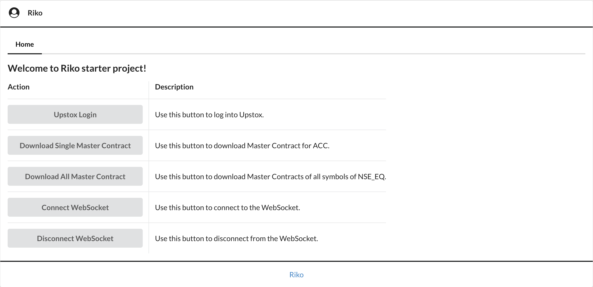

# Riko Starter

This is a web application to demonstrate the usage of [Riko](https://github.com/rishabh9/riko). 
It can also be used as starter template for your projects.

This project is a Spring Boot based application and uses Gradle for build and dependency management.

The code is pretty self explanatory with comments where required. Please let me know if it isn't sufficient.

Riko's [wiki](https://github.com/rishabh9/riko/wiki) references this project in its examples.

### Running the application

1. Ensure you have __JDK 9__ (or above) and __Git__ installed.
2. Clone this project.
3. `cd riko-starter`
4. Edit `com.github.rishabh9.rikostarter.constants.RikoStarterConstants` with your Upstox's `API Key` and `API Secret`.
4. `./gradlew build run` 
5. Open your browser and visit `http://localhost:8080`.

Keep an eye on the console logs to see what happens when you click a button on the UI.

### Screenshot

